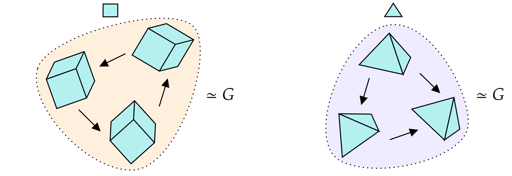

# Equivariant Representation Learning Through Class-Pose Decomposition

<p align="center">

</p>


## Setup
```
python 3.6+
pip install -r requirements.txt
```

## Datasets

To get the data, download each one from the specified URL and place the obtained directory in the `data` folder. 

`sprites`: https://drive.google.com/file/d/1xzWLtWwkif1fcbhITQDXVvdBRFS2OWyb/view?usp=sharing

`multi-sprites`: https://drive.google.com/file/d/1D9Tud8IyXU050ZM7A0ILBUo-THABJsFe/view?usp=sharing

`color-shift`: https://drive.google.com/file/d/1VVmPaH9LEpOmW3zF3_M7rj7P-lmjFe7X/view?usp=sharing

`chairs`: https://drive.google.com/file/d/1_maHTGbAu8SIowSwk3hQlMBhtzKhRbWt/view?usp=sharing

`room_combined`: https://drive.google.com/file/d/1GWUKg3G4evn3r7amFyhGcS6-aQyNtIPp/view?usp=sharing


## Experiments

Run the following bash commands to reproduce the experiments. 

Some example commands to train our model or the baselines:
For the other datasets, just replace `--dataset chairs` with any of the ones listed above.

### Our method
`python main.py --model-name test --method lie --model resnet_lie --dataset chairs --extra-dim 8 --regularization info-nce --epochs 100`

### MDPH
`python main.py --model-name mdp-test --method mdp --model mdp_resnet --dataset chairs --extra-dim 11 --regularization hinge --epochs 100`

### ENR
`python main.py --model-name enr-test --method enr --model enr --dataset chairs --epochs 100 --batch-size 16`

### Linear
`python main.py --model-name linear-test --method naive --model resnet_lie --extra-dim 3 --regularization hinge --dataset chairs --epochs 100`

The parameter `extra_dim` for MDPH is the entire dimension of the latent space and should be set accordingly.

Models and errors are saved in `checkpoints/{MODEL_NAME}`. 
Test errors are saved in a dictionary called `errors_val.pkl`. They keys for the hitrates on trajectories of length 1, 10, 20 are `mu_hitrate`, `mu_traj_10`, `mu_traj_20`. 

### Licenses
The datasets with translational symmetries `sprite`, `multi-sprites` were constructed from the following sources with licences:
https://github.com/deepmind/3d-shapes (Apache Licence),
https://github.com/deepmind/dsprites-dataset (Apache Licence).

The ResNet18 code was taken from: https://github.com/kuangliu/pytorch-cifar/blob/master/models/resnet.py (MIT Licence)

The Equivariant Neural Renderer (ENR) code was taken from: https://github.com/apple/ml-equivariant-neural-rendering (Apple Sample Code Licence)

The `chairs` dataset was generated using meshes from ShapeNet: https://shapenet.org/

The `rooms_combined` dataset was collected from the Gibson Environment: https://github.com/StanfordVL/GibsonEnv (MIT License)
