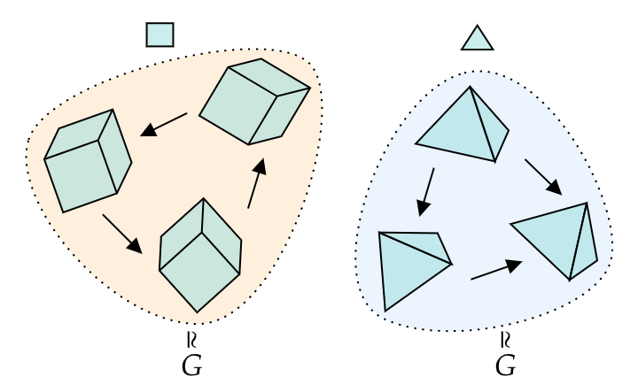

# Equivariant Representation Learning and Class-Pose Decomposition

<p align="center">

</p>


## Setup
```
python 3.6+
pip install -r requirements.txt
```

## Data
Run the following bash commands to download the datasets:

Sprites:
`python get_data.py --dataset sprites`

Color-shift:
`python get_data.py --dataset colorshift`

Multi-sprites:
`python get_data.py --dataset multi-sprites`

Platonics:
`python get_data.py --dataset platonic`

The first-person room dataset can be found at:
https://storage.googleapis.com/equivariant-project/combine.zip


## Experiments
Run the following bash commands to reproduce the experiments. Results (random decodings, errors and the model itself) are saved in the `./checkpoints/model-name` folder.


### Sprites
`python main.py --dataset sprites --action-dim 3 --extra-dim 2 --model-name sprites --decoder`

### Color-Shift
`python main.py --dataset color-shift --action-dim 3 --extra-dim 2 --model-name color-shift --decoder`

### Multi-Sprites
`python main.py --dataset multi-sprites --action-dim 6 --extra-dim 2 --model-name multi-sprites --decoder`

### Platonics
`python main.py --dataset platonics --action-dim 4 --extra-dim 2 --model-name platonics --decoder`

### Platonics With Linear Action
`python main.py --dataset platonics --action-dim 3 --extra-dim 0 --model-name platonics-linear --decoder --method naive`

### Platonics ENR
`python3 main_ENR.py --model-name platonics_ENR`

### First-Person Rooms
`python main.py --dataset room_combined --action-dim 4 --extra-dim 1 --model-name room`


### Licenses
The datasets with translational symmetries are constructed from the following sources with licences:
https://github.com/deepmind/3d-shapes (Apache Licence),
https://github.com/deepmind/dsprites-dataset (Apache Licence).

The dataset with the rooms is constructed using 3D-models from the following sources with licenses:
https://free3d.com/3d-model/room-48457.html (Personal Use License),
https://www.cgtrader.com/free-3d-models/interior/hall/hall-room (Royalty Free License),
https://www.cgtrader.com/free-3d-models/furniture/bed/bed-free8 (Royalty Free License),
https://free3d.com/3d-model/room-93514.html8 (Personal Use License).

The ResNet18 code has been taken from: https://github.com/kuangliu/pytorch-cifar/blob/master/models/resnet.py (MIT Licence)

The Equivariant Neural Renderer (ENR) code has been taken from: https://github.com/apple/ml-equivariant-neural-rendering (Apple Sample Code Licence)
